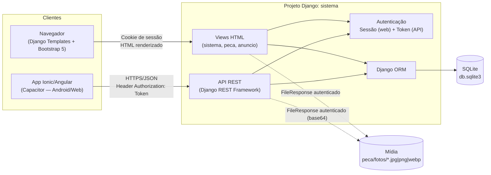
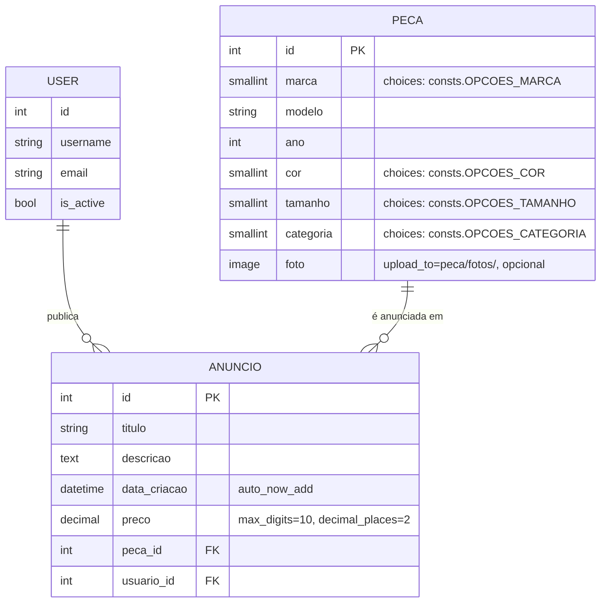

# Seleto Clouting — Marketplace de Roupas de Marca Usadas

Repositório da disciplina **Desenvolvimento Web/Mobile**, contendo um marketplace P2P de revenda de roupas de marca usadas, composto por:

- um **backend/web app em Django** (renderização server-side + API REST);
- um **app mobile em Ionic/Angular/Capacitor** que consome essa API.

> Domínio do sistema: muita gente tem peças de roupa de marca (Nike, Adidas, Lacoste, etc.) que comprou mas não usa mais — em vez de ficarem esquecidas no armário, o dono cadastra a **peça** e publica um **anúncio** de venda (título, descrição, preço) para alguém que quer aquela marca usada por um preço menor. O mesmo backend serve a interface web (HTML) e a API consumida pelo app mobile.

Este projeto é uma **refatoração de domínio** de um projeto-modelo ensinado pelo professor (originalmente um marketplace de veículos) — a arquitetura, os padrões de código e a metodologia são os mesmos; só o domínio de negócio mudou de "carro" para "roupa".

## Índice

1. [Visão geral](#visão-geral)
2. [Arquitetura](#arquitetura)
3. [Stack tecnológica](#stack-tecnológica)
4. [Estrutura de diretórios](#estrutura-de-diretórios)
5. [Modelagem de dados](#modelagem-de-dados)
6. [Funcionalidades](#funcionalidades)
7. [Rotas e endpoints](#rotas-e-endpoints)
8. [Metodologia e padrões de projeto](#metodologia-e-padrões-de-projeto)
9. [Como rodar o projeto](#como-rodar-o-projeto)
10. [Testes](#testes)
11. [Configurações e pontos sensíveis](#configurações-e-pontos-sensíveis)
12. [Limitações conhecidas e recomendações](#limitações-conhecidas-e-recomendações)
13. [Histórico de evolução do projeto](#histórico-de-evolução-do-projeto)
14. [Roadmap sugerido](#roadmap-sugerido)
15. [Documentação detalhada (`docs/`)](#documentação-detalhada-docs)
16. [Notas para assistentes de IA (Claude Code)](#notas-para-assistentes-de-ia-claude-code)

---

## Visão geral

O projeto é um **monorepo** com duas partes independentes que compartilham o mesmo domínio de negócio:

| Parte | Pasta | O que é |
|---|---|---|
| Backend + Web | `sistema/`, `peca/`, `anuncio/`, `templates/` | Projeto Django: autenticação por sessão, CRUD de peças e anúncios via páginas HTML, e uma API REST (DRF) com autenticação por token para o app mobile. |
| Mobile | `mobile/` | App Ionic 8 + Angular 20 (standalone components) + Capacitor 8, que consome a API REST do Django para login e gestão de peças. |

O mesmo banco de dados (SQLite) e a mesma base de usuários (`django.contrib.auth.User`) atendem tanto a interface web quanto o app mobile — ou seja, um usuário criado no Django Admin consegue logar tanto pelo navegador quanto pelo app.

## Arquitetura

### Visão geral dos componentes



Pontos-chave:

- **Um único backend, dois canais de entrada.** A Web usa autenticação por sessão (cookies) com `LoginRequiredMixin` nas views baseadas em classe. A API usa `TokenAuthentication` do DRF — o app mobile troca usuário/senha por um token em `/api/autenticacao-api/` e o envia em todas as requisições seguintes (`Authorization: Token <token>`).
- **Fotos não são servidas como arquivo estático comum.** Como não há `MEDIA_URL`/`MEDIA_ROOT` configurados em `sistema/settings.py`, não existe uma rota pública de mídia. Em vez disso, há views dedicadas (`FotoPeca` na Web, `APIFotoPeca` na API) que exigem autenticação e devolvem o arquivo via `FileResponse` — no app mobile, a imagem chega em base64 e é injetada diretamente no ``.
- **CORS restrito** (`django-cors-headers`) liberado apenas para `http://localhost:8100` (servidor de desenvolvimento do Ionic) e `capacitor://localhost` (app empacotado), configurado em `sistema/settings.py`.
- **`anuncio` não tem API.** Hoje só `peca` expõe endpoints REST; anúncios só existem na interface web. O app mobile, portanto, só gerencia peças.

### Fluxo de autenticação — Web

```
Usuário → POST / (usuario, senha)
       → sistema.views.Login.post()
       → django.contrib.auth.authenticate()
       → login(request, user) [cria sessão]
       → redirect → listar-pecas
```

### Fluxo de autenticação — Mobile

```
App → POST /api/autenticacao-api/ {username, senha}
   → sistema.views.LoginAPI (ObtainAuthToken customizado)
   → Token.objects.get_or_create(user)
   → resposta { id, nome, email, token }
   → app salva em Ionic Storage (chave "usuario")
   → próximas chamadas enviam "Authorization: Token <token>"
```

## Stack tecnológica

### Backend (Django)

| Tecnologia | Versão | Papel |
|---|---|---|
| Python | 3.14 | Linguagem do backend (ver `venv/`) |
| Django | 6.0.6 | Framework web (MVT), ORM, admin, autenticação de sessão |
| Django REST Framework | 3.17.1 | Serialização e views da API REST consumida pelo mobile |
| django-cors-headers | 4.9.0 | Liberação de CORS para o app Ionic/Capacitor |
| Pillow | 12.2.0 | Processamento de imagens (`ImageField` de `Peca.foto`) |
| SQLite | (embutido) | Banco de dados de desenvolvimento (`db.sqlite3`) |
| asgiref / sqlparse | 3.11.1 / 0.5.5 | Dependências internas do Django (ASGI e formatação de SQL no admin) |

### Frontend Web (renderizado pelo Django)

| Tecnologia | Versão | Papel |
|---|---|---|
| Django Templates | — | Herança de template (`base.html`) + blocos por página |
| Bootstrap | 5.x (vendorizado em `sistema/static/bootstrap/`) | Layout, grid e componentes visuais |
| Bootstrap Icons (classes `bi bi-*`) | — | Usadas nos templates, **porém o CSS/fonte de ícones não está incluído no projeto** (ver [Limitações](#limitações-conhecidas-e-recomendações)) |

### Mobile (app `mobile/`)

| Tecnologia | Versão | Papel |
|---|---|---|
| Ionic Framework | ^8.0.0 (`@ionic/angular`) | Componentes de UI mobile (`ion-*`) |
| Angular | ^20.0.0 | Framework SPA — **standalone components**, sem `NgModule` |
| Capacitor | 8.x | Empacotamento nativo (Android configurado em `mobile/android/`) e acesso a APIs nativas |
| @capacitor/core (`CapacitorHttp`) | 8.3.4 | Cliente HTTP nativo usado para falar com a API Django |
| @ionic/storage-angular | ^4.0.0 | Persistência local do usuário/token autenticado (IndexedDB/SQLite no device) |
| TypeScript | ~5.9.0 | Linguagem |
| RxJS | ~7.8.0 | Programação reativa (dependência do Angular/Ionic) |
| ESLint + typescript-eslint | ^9 / ^8 | Lint |
| Karma + Jasmine | ~6.4 / ~5.1 | Test runner / framework de testes unitários |
| Capacitor plugins | app, haptics, keyboard, status-bar | Integrações nativas básicas geradas pelo template padrão do Ionic |

## Estrutura de diretórios

```
auladevweb2/
├── manage.py                  # CLI de administração do Django
├── requirements.txt           # Dependências Python
├── db.sqlite3                 # Banco de dados local (gitignored)
├── docs/                       # Documentação detalhada do domínio (fonte de verdade)
│
├── sistema/                   # Projeto Django (configuração raiz)
│   ├── settings.py            # Configurações (DB, apps, CORS, templates, i18n)
│   ├── urls.py                # Roteamento raiz (login, logout, admin, includes)
│   ├── views.py                # Login (sessão), Logout, LoginAPI (token)
│   ├── asgi.py / wsgi.py      # Entry points ASGI/WSGI (padrão do startproject)
│   └── static/bootstrap/      # Bootstrap 5 vendorizado (css/ e js/)
│
├── peca/                       # App Django: cadastro de peças de roupa
│   ├── models.py               # Model Peca (+ anos_de_uso, peca_nova)
│   ├── consts.py                # Enums de marca/cor/tamanho/categoria (choices)
│   ├── forms.py                 # ModelForm para criação/edição
│   ├── serializers.py           # Serializer DRF (inclui nomes legíveis das choices)
│   ├── views.py                 # Views HTML (CRUD) + Views API (DRF generics)
│   ├── urls.py                   # Rotas HTML e de API do app
│   ├── admin.py                  # Registro no Django Admin
│   ├── tests.py                  # Testes (model + views) — cobertura real
│   ├── migrations/               # Histórico de schema
│   └── fotos/                    # Fotos enviadas (upload_to) — versionadas no git
│
├── anuncio/                    # App Django: anúncios de venda
│   ├── models.py                # Model Anuncio (FK Peca, FK User)
│   ├── forms.py                   # ModelForm com estilização de widgets
│   ├── views.py                   # Views HTML (CRUD) — sem API própria
│   ├── urls.py / admin.py / tests.py (boilerplate, sem testes próprios)
│   └── migrations/
│
├── templates/                    # Templates HTML globais
│   ├── base.html                  # Layout base (navbar + blocks)
│   ├── autenticacao.html           # Tela de login
│   ├── peca/{listar,novo,editar,excluir}.html
│   └── anuncio/{listar,novo,editar,excluir}.html
│
├── mobile/                        # App Ionic/Angular/Capacitor
│   ├── src/app/
│   │   ├── app.routes.ts          # Rotas: /home (login) e /pecas
│   │   ├── home/                   # Página de login (consome /api/autenticacao-api/)
│   │   └── pecas/                   # Listagem/edição/exclusão de peças via API
│   ├── src/environments/           # apiUrl por ambiente (dev aponta para localhost:8000)
│   ├── android/                     # Projeto nativo Android gerado pelo Capacitor
│   └── package.json
│
└── venv/                          # Virtualenv local (gitignored, não versionado)
```

## Modelagem de dados



### `Peca` (`peca/models.py`)

| Campo | Tipo | Observações |
|---|---|---|
| `marca` | `SmallIntegerField` (choices) | marcas de roupa em `peca/consts.py` (Nike, Adidas, Lacoste...) |
| `modelo` | `CharField(max_length=100)` | nome/descrição da peça, ex: "Camiseta Polo" |
| `ano` | `IntegerField` | ano/coleção da peça — usado por `anos_de_uso()` e pela property `peca_nova` |
| `cor` | `SmallIntegerField` (choices) | 9 opções |
| `tamanho` | `SmallIntegerField` (choices) | PP/P/M/G/GG/XG |
| `categoria` | `SmallIntegerField` (choices) | usado para filtro na listagem (camiseta, calça, vestido...) |
| `foto` | `ImageField` (`blank=True, null=True`) | salva em `peca/fotos/`; sem `MEDIA_ROOT/URL` explícitos |

Métodos: `anos_de_uso()` (ano atual − ano da peça) e a property `peca_nova` (`True` se o ano é o ano corrente).

### `Anuncio` (`anuncio/models.py`)

| Campo | Tipo | Observações |
|---|---|---|
| `titulo` | `CharField(max_length=200)` | — |
| `descricao` | `TextField` | — |
| `data_criacao` | `DateTimeField(auto_now_add=True)` | preenchido automaticamente |
| `preco` | `DecimalField(max_digits=10, decimal_places=2)` | — |
| `peca` | `ForeignKey(Peca, on_delete=CASCADE)` | — |
| `usuario` | `ForeignKey(User, on_delete=CASCADE)` | preenchido automaticamente com o usuário logado em `CriarAnuncio.form_valid` |

Para a especificação completa campo a campo, ver [`docs/02-modelo-de-dados.md`](./docs/02-modelo-de-dados.md) e os valores exatos dos enums em [`docs/03-enums-e-constantes.md`](./docs/03-enums-e-constantes.md).

## Funcionalidades

**Web (Django + templates):**
- Login/logout por sessão, com mensagens de erro (usuário inválido / inativo).
- CRUD completo de peças (listar com busca por nome/modelo e filtro por categoria, criar, editar, excluir com tela de confirmação), com upload de foto.
- CRUD completo de anúncios (listar com busca, criar associando automaticamente o usuário logado, editar, excluir).
- Django Admin habilitado para `Peca` e `Anuncio` (`list_display` + `search_fields`).

**API REST (consumida pelo app mobile):**
- Autenticação por token (`/api/autenticacao-api/`).
- CRUD completo de peças via API: listar (com filtro por categoria), criar, editar, excluir e download autenticado de foto.
- CRUD completo de anúncios via API (`/anuncio/api/`): listar, criar, editar e excluir — sempre filtrado pelo usuário logado.

**Mobile (Ionic/Angular/Capacitor):**
- Tela de login que troca credenciais por token e persiste a sessão localmente (`@ionic/storage-angular`), com redirecionamento automático se já houver sessão salva.
- Listagem de peças com pull-to-refresh (`ion-refresher`) e filtro por categoria.
- Criação de nova peça com upload de foto (página dedicada `/nova-peca`).
- Edição inline via modal (`ion-modal`) com preview e troca de foto; exclusão com gesto de slide (`ion-item-sliding`) + confirmação (`AlertController`).
- Carregamento de fotos autenticadas convertidas para base64 e exibidas por peça.
- Botão "Anunciar" no swipe do card de peça: abre modal de criação de anúncio com peça pré-selecionada.
- Tela "Meus Anúncios" (`/anuncios`): lista, edita e exclui os próprios anúncios.
- Logout com confirmação, limpando o storage local.

## Rotas e endpoints

### Web (sessão)

| Método | Rota | View | Nome | Autenticação |
|---|---|---|---|---|
| GET/POST | `/` | `Login` | `login` | Pública |
| GET | `/logout/` | `Logout` | `logout` | Sessão |
| GET | `/admin/` | Django Admin | `admin:*` | Staff |
| GET | `/peca/listar-peca/?pesquisa=&categoria=` | `ListarPecas` | `listar-pecas` | Sessão (`LoginRequiredMixin`) |
| GET/POST | `/peca/novo/` | `CriarPeca` | `criar-peca` | Sessão |
| GET/POST | `/peca/editar/<pk>/` | `EditarPeca` | `editar-peca` | Sessão |
| GET/POST | `/peca/excluir/<pk>/` | `ExcluirPeca` | `excluir-peca` | Sessão |
| GET | `/peca/fotos/<path:arquivo>` | `FotoPeca` | `foto-peca` | Sessão |
| GET | `/anuncio/listar-anuncio/?pesquisa=` | `ListarAnuncio` | `listar-anuncios` | Sessão |
| GET/POST | `/anuncio/novo/` | `CriarAnuncio` | `criar-anuncio` | Sessão |
| GET/POST | `/anuncio/editar/<pk>/` | `EditarAnuncio` | `editar-anuncio` | Sessão |
| GET/POST | `/anuncio/excluir/<pk>/` | `ExcluirAnuncio` | `excluir-anuncio` | Sessão |

### API REST (token)

**Autenticação**

| Método | Rota | View | Autenticação | Retorno |
|---|---|---|---|---|
| POST | `/api/autenticacao-api/` | `LoginAPI` | Pública (recebe `username`/`password`) | `{ id, nome, email, token }` |

**Peça**

| Método | Rota | View | Autenticação | Retorno |
|---|---|---|---|---|
| GET | `/peca/api/listar/?categoria=` | `APIListarPecas` | `Token` | Lista de peças (serializadas), filtrável por categoria |
| POST | `/peca/api/novo/` | `APICriarPeca` | `Token` | Peça criada (`multipart/form-data`) |
| GET | `/peca/api/foto/<pk>/` | `APIFotoPeca` | `Token` | Binário da imagem (`image/jpeg`) |
| PUT/PATCH | `/peca/api/editar/<pk>/` | `APIEditarPeca` | `Token` | Peça atualizada |
| DELETE | `/peca/api/excluir/<pk>/` | `APIExcluirPeca` | `Token` | `204 No Content` |

**Anúncio** — todos os endpoints filtram por usuário logado

| Método | Rota | View | Autenticação | Retorno |
|---|---|---|---|---|
| GET | `/anuncio/api/listar/` | `APIListarAnuncios` | `Token` | Lista de anúncios do usuário logado |
| POST | `/anuncio/api/novo/` | `APICriarAnuncio` | `Token` | Anúncio criado |
| PUT/PATCH | `/anuncio/api/editar/<pk>/` | `APIEditarAnuncio` | `Token` | Anúncio atualizado |
| DELETE | `/anuncio/api/excluir/<pk>/` | `APIExcluirAnuncio` | `Token` | `204 No Content` |

## Metodologia e padrões de projeto

- **Django MVT + apps por domínio.** Cada entidade de negócio é um app Django isolado (`peca`, `anuncio`), cada um com `models.py`, `views.py`, `urls.py`, `forms.py`, `admin.py`, `tests.py` e `migrations/` — separação de responsabilidades padrão do framework.
- **Class-Based Views consistentes.** CRUD inteiramente baseado nas genéricas do Django (`ListView`, `CreateView`, `UpdateView`, `DeleteView`) tanto para `Peca` quanto `Anuncio`, com `success_url` via `reverse_lazy` e proteção via `LoginRequiredMixin`.
- **Dois mecanismos de autenticação por canal.** Sessão/cookie para a Web (`django.contrib.auth`), Token (`rest_framework.authtoken`) para a API — desenhado especificamente para o consumo pelo app mobile (ver `CORS_ALLOWED_ORIGINS` em `sistema/settings.py`).
- **Enumerações centralizadas, porém duplicadas entre stacks.** As opções de marca/cor/tamanho/categoria vivem em `peca/consts.py` no backend e são *replicadas manualmente* em `mobile/src/app/pecas/pecas.consts.ts` no app — não há uma única fonte de verdade consumida via API. Os valores exatos estão documentados em [`docs/03-enums-e-constantes.md`](./docs/03-enums-e-constantes.md) para evitar divergência.
- **Fotos como recurso protegido, não como mídia pública.** Em vez de configurar `MEDIA_URL` público, o projeto optou por views autenticadas dedicadas para servir fotos — coerente com o requisito de que só usuários logados (web) ou com token válido (API) vejam as imagens.
- **Angular moderno sem NgModules.** O app mobile usa **standalone components** (`imports: [...]` no próprio `@Component`) e *lazy loading* por rota (`loadComponent`), em vez do padrão clássico `NgModule` — alinhado com as práticas atuais do Angular (v20).
- **Nomenclatura em português** em todo o domínio (models, views, templates, rotas, variáveis de componente no mobile) — convenção deliberada do projeto, mantida de ponta a ponta.
- **Testes como parte do app `peca`.** `peca/tests.py` cobre o model (propriedades calculadas) e as views (listagem, criação, edição, exclusão, incluindo casos autenticado/não autenticado). `anuncio/tests.py` e os specs do mobile ainda são apenas boilerplate (ver [Testes](#testes)).

## Como rodar o projeto

### Pré-requisitos

- Python 3.12+ (projeto testado com 3.14)
- Node.js 18+ e npm (para o app mobile)
- Opcional: [Ionic CLI](https://ionicframework.com/docs/cli) (`npm i -g @ionic/cli`) e Android Studio (para build nativo Android)

### 1. Backend Django

```bash
# na raiz do repositório
python3 -m venv venv
source venv/bin/activate          # Windows: venv\Scripts\activate

pip install -r requirements.txt

# aplica o schema do banco (SQLite, criado automaticamente)
python manage.py migrate

# cria um usuário para login (web e mobile usam o mesmo usuário)
python manage.py createsuperuser

# inicia o servidor de desenvolvimento
python manage.py runserver
```

- Web: http://localhost:8000/ (login com o usuário criado acima)
- Admin: http://localhost:8000/admin/
- API: http://localhost:8000/api/autenticacao-api/, http://localhost:8000/peca/api/...

> Sem fixtures/seed de dados — a primeira peça precisa ser cadastrada manualmente pela tela "Novo" ou pelo Admin antes de haver algo para listar.

### 2. App mobile (Ionic/Angular/Capacitor)

```bash
cd mobile
npm install

# garanta que o backend Django esteja rodando em http://localhost:8000
# (configurado em src/environments/environment.ts)

npx ionic serve     # ou: npm start
```

- Abre em http://localhost:8100 — endereço já liberado em `CORS_ALLOWED_ORIGINS` no backend.
- Login: mesmas credenciais do usuário Django criado no passo anterior.

Para build nativo Android:

```bash
npm run build
npx cap sync android
npx cap open android   # abre no Android Studio
```

> No emulador Android, `localhost` do host não é acessível diretamente — use `10.0.2.2` (há um comentário já preparado em `src/environments/environment.ts`).

## Testes

```bash
# backend Django
python manage.py test                 # roda todos os apps
python manage.py test peca             # só o app com cobertura real

# mobile
cd mobile
npm test                                # Karma + Jasmine (specs gerados pelo Angular CLI)
```

- `peca/tests.py`: testes de model (`peca_nova`, `anos_de_uso`) e de views (listagem com busca e filtro de categoria, criação, edição e exclusão — incluindo o caminho "usuário não autenticado é redirecionado").
- `anuncio/tests.py`: apenas o boilerplate gerado pelo `startapp`, sem casos de teste ainda.
- `mobile/**/*.spec.ts`: specs padrão do Angular CLI (`should create`), sem testes de lógica de negócio (login, listagem, edição) implementados ainda.

## Configurações e pontos sensíveis

Tudo abaixo está em `sistema/settings.py` e é adequado para **desenvolvimento**, não para produção:

| Configuração | Valor atual | Observação |
|---|---|---|
| `SECRET_KEY` | hardcoded no arquivo | mover para variável de ambiente antes de qualquer deploy |
| `DEBUG` | `True` | desligar em produção (expõe stack traces) |
| `ALLOWED_HOSTS` | `['*']` | restringir aos domínios reais em produção |
| `DATABASES` | SQLite (`db.sqlite3`) | adequado para estudo/dev; considerar Postgres para produção |
| `CORS_ALLOWED_ORIGINS` | `localhost:8100`, `capacitor://localhost` | atualizar se o app for publicado/empacotado com outro origin |
| `LANGUAGE_CODE` / `TIME_ZONE` | `pt-br` / `UTC` | — |
| `LOGIN_URL` | `/` | usado pelo `LoginRequiredMixin` e pela view `Logout` |

Não há arquivo `.env`/`django-environ` configurado — `SECRET_KEY` e demais valores sensíveis estão hardcoded no código-fonte versionado.

## Limitações conhecidas e recomendações

1. **Classes `bi bi-*` (Bootstrap Icons) usadas sem o CSS correspondente incluído.** Os templates usam ícones do Bootstrap Icons, mas nenhum arquivo do projeto referencia `bootstrap-icons.css` ou a fonte de ícones — os ícones provavelmente não renderizam. Adicionar o pacote (CDN ou vendorizado, como já é feito com o Bootstrap base).
2. **`MEDIA_URL`/`MEDIA_ROOT` não configurados.** As fotos de peças vivem em `peca/fotos/` (resolvido como caminho relativo por padrão do Django) e estão **versionadas no Git** — o ideal é configurar `MEDIA_ROOT` explicitamente fora do controle de versão (e usar `.gitignore`), mantendo as views autenticadas que já existem para servir os arquivos.
3. **Sem testes para `anuncio`** (backend) **nem para a lógica do app mobile** (login, listagem, edição, exclusão) — hoje só existem specs/testes de criação de componente gerados automaticamente.
4. **Sem pipeline de CI** nem separação de settings por ambiente (`settings/dev.py` vs `settings/prod.py`) — tudo roda a partir de um único `settings.py` com flags de desenvolvimento.
5. **Sem fonte única de verdade para enums** — `peca/consts.py` (backend) e `pecas.consts.ts` (mobile) são mantidos manualmente em sincronia; ver [`docs/03-enums-e-constantes.md`](./docs/03-enums-e-constantes.md) para os valores definitivos e evitar divergência futura.

Não corrija os itens acima de forma proativa/silenciosa — são observações para guiar decisões futuras. Só atue sobre eles se o usuário pedir explicitamente.

## Histórico de evolução do projeto

| Marco | O que mudou |
|---|---|
| Scaffold inicial | Projeto Django original (`sistema/`, `manage.py`, `db.sqlite3`), ensinado pelo professor com domínio de veículos. |
| Sistema modelo do professor | Apps `veiculo`/`anuncio` completos, API REST + token, CORS, app mobile Ionic/Angular/Capacitor inteiro, Bootstrap vendorizado — projeto entregue como referência da disciplina. |
| Refatoração para "Seleto Clouting" | Domínio trocado de veículos para marketplace de roupas de marca usadas: apps renomeados/remodelados (`veiculo`→`peca`), novos campos (`tamanho`, `categoria`), enums atualizados, mobile e templates portados, bugs latentes do projeto original corrigidos. Ver [`docs/08-plano-de-migracao.md`](./docs/08-plano-de-migracao.md) para o histórico detalhado da migração. |

## Roadmap sugerido

- [ ] Incluir Bootstrap Icons de fato (CSS/fonte) nos templates que já usam as classes `bi bi-*`
- [ ] Mover `SECRET_KEY` e flags de ambiente para variáveis de ambiente (`.env` + `django-environ`/`python-decouple`)
- [ ] Configurar `MEDIA_ROOT`/`MEDIA_URL` e remover fotos versionadas do Git
- [ ] Criar API REST para `Anuncio` (hoje só `Peca` tem endpoints)
- [ ] Escrever testes para `anuncio` (backend) e para a lógica das páginas do app mobile
- [ ] Adicionar CI (lint + testes) para os dois projetos (Django e Ionic)
- [ ] Expor os enums via API em vez de duplicá-los manualmente no mobile

## Documentação detalhada (`docs/`)

A pasta [`docs/`](./docs/00-indice.md) é a fonte de verdade granular sobre domínio, modelo de dados, enums, rotas e convenções de código — útil tanto para o aluno quanto para o Claude Code não inferir/alucinar detalhes ao longo de múltiplas sessões de desenvolvimento. Ver [`docs/00-indice.md`](./docs/00-indice.md) para o índice completo.

## Notas para assistentes de IA (Claude Code)

Este README documenta o estado completo do projeto. Para que o **Claude Code** tenha esse mesmo entendimento carregado automaticamente em toda nova sessão (sem precisar reler este arquivo), o contexto essencial também foi replicado em [`CLAUDE.md`](./CLAUDE.md) na raiz do repositório — esse é o arquivo que a ferramenta carrega de forma automática como memória de projeto. Detalhes granulares de domínio/modelo/rotas/convenções estão em [`docs/`](./docs/00-indice.md). Ao trabalhar neste repositório, mantenha os três coerentes: mudanças estruturais (novo app, nova stack, mudança de arquitetura, novo campo/enum) devem refletir em `README.md`, `CLAUDE.md` e na pasta `docs/` correspondente.
